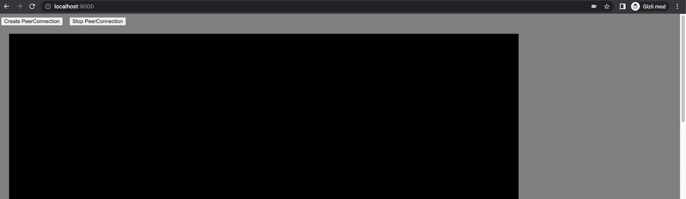
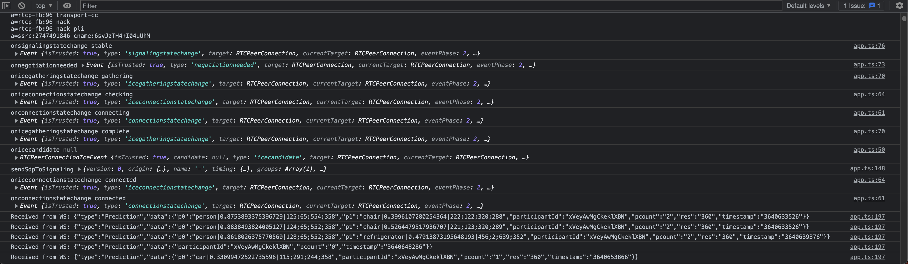

# **Distributed Deep Learning Inference Pipeline**

[](https://www.linkedin.com/in/alper-dalkiran/)
[](https://twitter.com/aalperdalkiran)


Cross-language and distributed deep learning inference pipeline for WebRTC video streams over Redis Streams. Currently supports YOLOX model, which can run well on CPU.

This project consists of WebRTC signaling and orchestrator service(Go), WebRTC media server service (Go), YOLOX model deep learning inference service (Python), and Web front-end (TypeScript).

Uses for functionality:
* [Inventa for Go](https://github.com/adalkiran/go-inventa) and [Inventa for Python](https://github.com/adalkiran/py-inventa) to do service orchestration and to make RPC over Redis. For more information, you can check out [Inventa Examples](https://github.com/adalkiran/inventa-examples) repo.
* [Pion WebRTC](https://github.com/pion/webrtc) library to implement WebRTC related stuff.
* [ONNX](https://onnx.ai) and [ONNX Runtime](https://onnxruntime.ai) to run models both on CPU and GPU.
* [PyTorch](https://pytorch.org) as [ONNX Runtime](https://onnxruntime.ai) backend.
* [YOLOX model](https://github.com/Megvii-BaseDetection/YOLOX) for object detection from captured images.

Uses for monitoring:
* [Grafana](https://grafana.com/) ([github](https://github.com/grafana/grafana)) to monitor metrics visually.
* [InfluxDB](https://www.influxdata.com/) ([github](https://github.com/influxdata/influxdb)) to store collected metrics.
* [Prometheus](https://prometheus.io/) ([github](https://github.com/prometheus/prometheus)) for service discovery and collecting metrics of microservices on each host. Prometheus is used in "agent mode" in this project's configuration, it pushes data to Telegraf instance with "remote write" method.
* [Telegraf](https://www.influxdata.com/time-series-platform/telegraf/) ([github](https://github.com/influxdata/telegraf)) for container discovery and collect statistics of Docker Containers and microservice metrics from Prometheus on each host, it pushes to central InfluxDB instance.

<br>


<br>

## **WHY THIS PROJECT?**

This project aims to demonstrate an approach to designing cross-language and distributed pipeline in deep learning/machine learning domain. Tons of demos and examples can be found on the internet which are developed end-to-end only (mostly) in Python. But this project is one of cross-language examples.

In this project, a Kubernetes-like orchestrator was not used, in place of this,  independent Docker engines on different bare-metal host machines were configured, on purpose. The aim is to show how to configure things on multi-bare-metal host machines or multi-datacenter environments, only using Docker.

<br>

## **DOCUMENTATION**

More details of the project and monitoring configuration can be found in [docs folder](docs/).

<br>

## **WEB APPLICATION**



When you click on "Create PeerConnection" button, if everything is configured correctly:
* It wants you to give permission to the browser to access your webcam,
* Your webcam will be turned on and webcam video will be played in the black area,
* Webcam video will be streamed to the ```Media Bridge``` service via WebRTC,
* ```Media Bridge``` service will capture frame images from the video as JPEG images, pushes them to Redis Streams,
* One of available ```Inference``` services will pop a JPEG image data from Redis Streams stream (```STREAM_IMAGES = "images"```), execute YOLOX inference model, push detected objects' name, box coordinates, prediction score and resolution to other Redis Streams stream (```STREAM_PREDICTIONS = "predictions"```),
* The ```Signaling``` service listens and consumes the Redis Streams stream (```predictions```), sends the results to relevant participant (by ```participantId``` in the JSON) via WebSockets.
* Web client will draw boxes for each prediction, and writes results to the browser console.

<br>

**Client side logs:**



<br>

## **MONITORING**

**Monitoring topology:**


<br>

## **INSTALLATION and RUNNING**

This project was designed to run in Docker Container. For some configurations, you can check out docker-compose.yaml and .env files in the root folder.

Docker Compose file creates some containers, with some replica instances:
* **redis:** Runs a Redis instance.
* **web:** Runs an Nginx instance for proxy passing HTTP and WebSocket endpoints.
* **signaling service:** The only orchestrator in the project. Other services will register themselves to this application. Also, it serves a WebSocket for doing WebRTC signaling function. When a WebRTC comes to join, this service selects one of registered media bridge services and brings the WebRTC client and media bridge together. Written in Go language.

* **mediabridge service:** The service will register itself to the orchestrator, and can respond to "sdp-offer-req" and "sdp-accept-offer-answer" procedure calls. Also uses [Pion WebRTC](https://github.com/pion/webrtc) library to serve as a WebRTC server on a UDP port. Written in Go language.
    <br>
    Designed to run as more than one instance, but currently can run only one instance because it should expose a UDP port from Docker container, and different container replicas on same host should be assigned different and available port numbers and the application must know the exposed host port number, in this stage, it couldn't be achieved to dynamically manage this. Maybe it can be achieved on Kubernetes.

* **inference:** The service will register itself to the orchestrator, and can keep track of "images" Redis Stream which streams JPEG image data of video frames. Written in Python language. It makes inferences on incoming images with YOLOX model for object detection.
    <br>
    According to configuration or chosen Docker Compose Profile, it can run on CPU or CUDA modes, and also can run as distributed service in different machines.
    <br>
    Can be more than one, by docker-compose.yml file's replica values, default is 5.

* **ui:** The web frontend. It gets a media stream from webcam and forwards it to assigned mediabridge service via WebRTC.

You can run it in production mode or development mode.

### **Production Mode**

#### **Note: Docker Host Operating System**

After completion of chosen one of options below, this step should be done:

* Edit ```.env``` file.
* Specify ```HOSTNAME_TAG``` different value to differentiate host metrics in Grafana:

```
...
HOSTNAME_TAG=tag_name_for_host_machine
...
```

* If Docker Host operating system is **Linux**, ```DOCKER_SOCKET_PREFIX``` and ```DOCKER_SOCKET_SUFFIX``` should be left blank as:

```
...
DOCKER_SOCKET_PREFIX=""
DOCKER_SOCKET_SUFFIX=""
...
```

* If Docker Host operating system is **Windows**, ```DOCKER_SOCKET_PREFIX``` should be "/" as:
<br>
(See: https://stackoverflow.com/a/41005007)
```
...
DOCKER_SOCKET_PREFIX="/"
DOCKER_SOCKET_SUFFIX=""
...
```

* If Docker Host operating system is **MacOS**, ```DOCKER_SOCKET_SUFFIX``` should be ".raw" as:
<br>
(See: https://github.com/docker/for-mac/issues/4755)

```
...
DOCKER_SOCKET_PREFIX=""
DOCKER_SOCKET_SUFFIX=".raw"
...
```

There are different Docker Compose Profiles for different configurations you can choose:

#### **1. Single Host, only CPU**

This profile is to run whole services in same host machine, which has no graphic card supporting CUDA. Redis instance will be staying internal, and won't be exposed to network.

* Clone this repo and run in terminal:

```sh
$ docker-compose --profile single_host_cpu up -d
```

#### **2. Single Host, with GPU support**

This profile is to run whole services in same host machine, which has at least one graphic card supporting CUDA. Redis instance will be staying internal, and won't be exposed to network.

* Clone this repo and run in terminal:

```sh
$ docker-compose --profile single_host_gpu up -d
```

#### **3. Central services with inference service, only CPU**

This profile is to run whole services in same host machine, which has no graphic card supporting CUDA. Redis instance will be exposed to network, so other inference services on different hosts can be registered further.

Similar to ```single_host_cpu```, it can provide all services individually, but supports extra hosts.

* Clone this repo and run in terminal:

```sh
$ docker-compose --profile central_with_inference_cpu up -d
```

#### **4. Central services with inference service, with GPU support**

This profile is to run whole services in same host machine, which has at least one graphic card supporting CUDA. Redis instance will be exposed to network, so other inference services on different hosts can be registered further.

Similar to ```single_host_cpu```, it can provide all services individually, but supports extra hosts.

* Clone this repo and run in terminal:

```sh
$ docker-compose --profile central_with_inference_gpu up -d
```

#### **5. Central services without inference service, multiple hosts mode**

##### **5.1. Steps should be done in central host:**

This profile is to run only central services in host machine, without inference services. It doesn't function without any extra inference services with properly registered into Signaling service. Redis instance will be exposed to network, so other inference services on different hosts can be registered further.

* Clone this repo and run in terminal:

```sh
$ docker-compose --profile central up -d
```

##### **5.2. Steps should be done in other multiple inference hosts:**

* Clone this repo.
* Edit ```.env``` file, specify the central host's Redis server and InfluxDB server connection information with ```REDIS_HOST```, ```REDIS_PORT``` ```INFLUXDB_HOST```, ```INFLUXDB_PORT``` environment variables, as your central host's IP:

```
...
REDIS_HOST=ip_of_central_host # should be "redis" if single host configuration, e.g. 192.168.0.15 in distributed configuration
REDIS_PORT=port_of_central_host_redis_port # default is 6379
...
INFLUXDB_HOST=ip_of_central_host # should be "influxdb" if single host configuration, e.g. 192.168.0.15 in distributed configuration
INFLUXDB_PORT=port_of_central_host_influxdb_port  # default is 8086
...

```

**For only CPU mode:**

* Run in terminal:

```sh
$ docker-compose --profile inference_cpu up -d
```

**For with GPU support mode:**

* Run in terminal:

```sh
$ docker-compose --profile inference_gpu up -d
```


#### **Common post-instructions for all alternative configurations:**

* Wait until Go and Python modules were installed and configured. This can take some time. You can check out the download status by:

```sh
$ docker-compose logs -f
```

* After waiting for enough time, open a web browser and visit http://localhost:9000 (Tested on Chrome)

### <a name="dev-mode"></a>**Development Mode: VS Code Remote - Containers**

To continue with VS Code and if this is your first time to work with Remote Containers in VS Code, you can check out [this link](https://code.visualstudio.com/docs/remote/containers) to learn how Remote Containers work in VS Code and follow the installation steps of [Remote Development extension pack](https://marketplace.visualstudio.com/items?itemName=ms-vscode-remote.vscode-remote-extensionpack).

Then, follow these steps:

* Clone this repo to your local filesystem
* Due to VS Code hasn't support Docker Compose Profiles yet, we can't let VS Code trigger docker-compose via devcontainer.json file, you should call docker-compose manually as described above, in **Production Mode** chapter.
* Open the folder "distributed-inference" with VS Code by "Open Folder..." command. This opens the root folder of the project.
* Ensure correct service name written at ```service``` key at ```.devcontainer/devcontainer.json``` of particular service folder you want to debug.
* Press <kbd>F1</kbd> and select **"Remote Containers: Open Folder in Container..."** then select one of folders in the root folder, not the root folder itself. You can select any of the services, which you want to develop.
* This command connects inside of distributed-inference-[your-selected-service] container for development and debugging purposes.
* Wait until the container configured, and related VS Code server extensions installed inside the container. This can take some time. VS Code can ask for some required installations, click "Install All" for these prompts.
* After completion of all installations, press <kbd>F5</kbd> to start server application.
    <br>
    **Note:** Maybe you must kill existing running service processes by terminal.
* Then, you can keep track of other services with docker logs.
* Then, open a web browser and visit http://localhost:9000 (Tested on Chrome)

<br>

## **LICENSE**

Distributed Deep Learning Inference Pipeline project is licensed under the Apache License, Version 2.0. See [LICENSE](LICENSE) for the full license text.