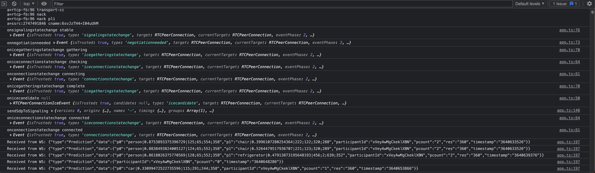

# **1. APPLICATION**

**Simply:** This project aims to:

* Stream webcam video from the browser to the server via WebRTC,
* Capture frames from the video stream as JPEG images, run YOLOX model inference for these images to detect objects, send prediction results to client, with object type and box coordinates, then draw detected boxes on the browser.

**With distributed details:** This project aims to:

* **Web UI:** Stream webcam video from the browser to the media server via WebRTC,
* **Media Server:** Capture frames from the video stream as JPEG images, push image binary arrays to Redis Streams,
* **Inference Worker Instances:** Consume Redis Streams (```STREAM_IMAGES = "images"```), take one image item from queue, run YOLOX model inference for this image to detect objects, send prediction results to another Redis Streams (```STREAM_PREDICTIONS = "predictions"```) with object type and box coordinates,
* **Signaling Server:** Consume Redis Streams (```STREAM_PREDICTIONS = "predictions"```), take prediction results to client browser via web sockets,
* **Web UI:** Listen for Signaling web sockets, for incoming prediction results, draw coordinate boxes and prediction labels on the screen.


This project consists of WebRTC signaling and orchestrator service(Go), WebRTC media server service (Go), YOLOX model deep learning inference service (Python), and Web front-end (TypeScript).

<br>

**Application topology:**


<br>

**Web UI Screenshot:**


**Client side logs:**

You can track the incoming predictions via web sockets on the browser's console:




<br>

---

<div align="right">

[&lt;&nbsp;&nbsp;Previous chapter: INFRASTRUCTURE](./00-INFRASTRUCTURE.md)&nbsp;&nbsp;&nbsp;&nbsp;&nbsp;&nbsp;|&nbsp;&nbsp;&nbsp;&nbsp;&nbsp;&nbsp;[Next chapter: MONITORING&nbsp;&nbsp;&gt;](./02-MONITORING.md)

</div>